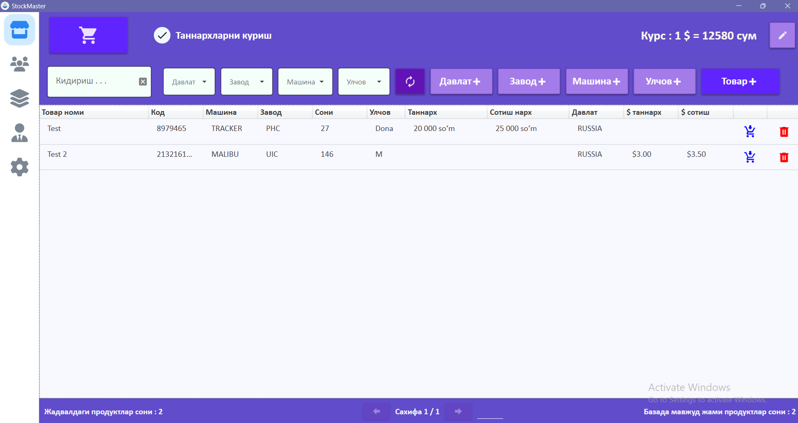
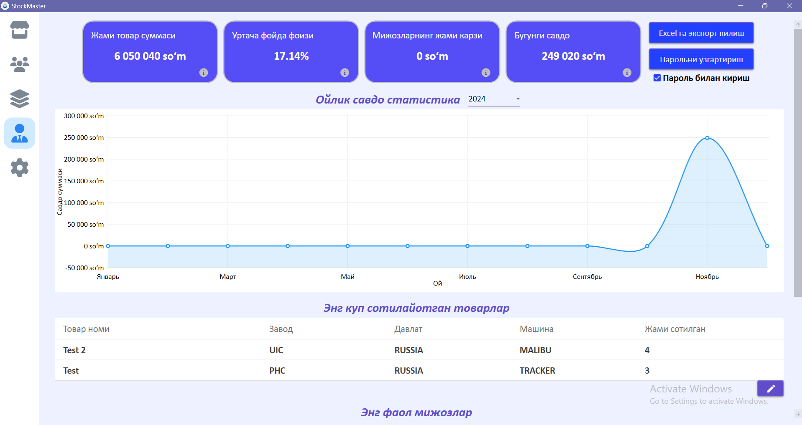
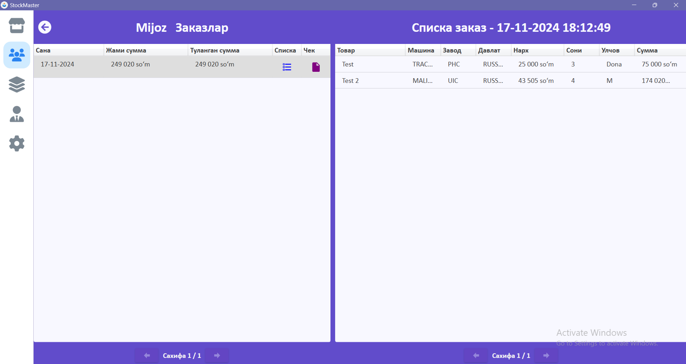

# **📦 StockMaster **

**StockMaster** is a comprehensive desktop-based **CRM (Customer Relationship Management)** and inventory management application. Designed for local businesses, it streamlines inventory tracking, client interaction, and financial insights to improve efficiency and decision-making.

---

## **✨ Features**

### **📋 Inventory Management**
- 🏷️ **Barcode scanner** integration for seamless product tracking.
- 📊 Export inventory data to **Excel** for reporting and analysis.
- 🧾 Cheque and receipt generation and XPS printing using thermoprinters.

### **👥 Customer Relationship Management**
- 🕵️ Tracks client history, including purchases and **debts**.
- 🌟 Provides insights into the **best customers** and overall client interactions.

### **📈 Statistics Dashboard**
- View key metrics such as:
  - 🛒 **Best-selling products**.
  - 💰 Shop's **net worth**.
  - 📉 **Income percentage trends**.

### **⚙️ User-Friendly Admin Panel**
- 🔍 Advanced filtering and sorting tools reduce search time by **50%**.
- 🎨 Intuitive and interactive UI designed with **XAML Material Design**.

### **🚀 Performance Optimization**
- 🗂️ Improved query speed by implementing **barcode column indexing**.

## **🛠️ Technology Stack**
- WPF (Windows Presentation Foundation), C#, Sqlite.

--- 

### **📷 Screenshots**
**Main Page**

**Admin Page**

**History Page**

